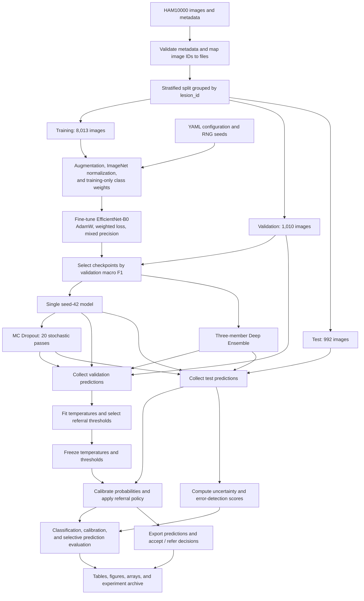

# Uncertainty-Aware Skin Lesion Classification with Human Referral

A computer vision research pipeline that classifies dermoscopic images into seven skin lesion categories, evaluates how trustworthy its predictions are, and routes uncertain cases to a simulated human-review queue.

The project connects the full experimental ML workflow: dataset validation, leakage-safe splitting, transfer learning, GPU training, checkpoint selection, probability calibration, uncertainty estimation, and selective prediction. Reusable Python modules implement the pipeline; a Kaggle notebook orchestrates training, comparisons, and artifact export.

**Key result:** a three-model EfficientNet-B0 ensemble improved melanoma recall from **67.57% to 77.48%** and macro F1 from **0.7144 to 0.7308**, with comparable overall accuracy. Its validation-selected referral policy accepted **882 of 992 test images**, achieving **86.05% accuracy on the accepted subset** and referring the remaining 110 images.

[Experiment notebook](notebooks/skin-lesion-uncertainty-final-experiments.ipynb) · [Kaggle experiment runs](https://www.kaggle.com/code/dilojanravindrarasa/skin-lesion-uncertainty-final-experiments) · [Experiment configuration](configs/experiment.yaml) · [Source code](src/) · [Tests](tests/)

## Project scope

The central question is whether confidence calibration and uncertainty estimation can help a classifier recognize cases that warrant human review. A correct class prediction, a reliable probability, and a useful referral decision are evaluated as separate outcomes.

The system compares three predictive approaches on the same HAM10000 split:

- **Single model:** an ImageNet-pretrained EfficientNet-B0, fine-tuned for seven classes.
- **Deep Ensemble:** three independently trained EfficientNet-B0 models, with seeds `42`, `123`, and `999`, whose class probabilities are averaged.
- **Monte Carlo Dropout:** 20 stochastic inference passes through the seed-42 model, with classifier dropout active and Batch Normalization in evaluation mode.

Each approach is evaluated before and after Temperature Scaling. Uncertainty scores are assessed for error detection and for deciding which predictions to accept or refer.

This is an offline research prototype. Human referral is implemented as exported `accept` / `refer` decisions; clinician review and clinical outcomes are outside the experiment.

## Pipeline architecture



The notebook coordinates the experiment, while `src/` separates data processing, model construction, training, inference, calibration, uncertainty, referral, and plotting. Saved logits and probabilities let downstream analyses run without repeating GPU training.

## Data engineering and evaluation design

HAM10000 contains **10,015 images from 7,470 unique lesions**. Multiple images can represent the same physical lesion, so a random image-level split could leak related examples into training and evaluation.

[Data utilities](src/data.py) use `StratifiedGroupKFold` to keep every `lesion_id` within a single partition while approximately preserving class proportions. Explicit leakage checks verify this constraint, and split assignments are saved as CSV files.

| Partition | Images | Unique lesions | Role |
| --- | ---: | ---: | --- |
| Train | 8,013 | 5,976 | Learn model weights and calculate class weights |
| Validation | 1,010 | 747 | Select checkpoints, fit temperatures, select referral thresholds |
| Test | 992 | 747 | Evaluate the models and frozen referral policies |

The target ratio is 80/10/10; actual counts differ slightly because lesion groups remain intact.

| Label | Category | Total images |
| --- | --- | ---: |
| `akiec` | Actinic keratoses / intraepithelial carcinoma | 327 |
| `bcc` | Basal cell carcinoma | 514 |
| `bkl` | Benign keratosis-like lesions | 1,099 |
| `df` | Dermatofibroma | 115 |
| `mel` | Melanoma | 1,113 |
| `nv` | Melanocytic nevi | 6,705 |
| `vasc` | Vascular lesions | 142 |

The dominant `nv` class makes accuracy alone insufficient. Inverse-frequency weights are calculated from the training partition as `N_train / (7 × class_count)` and used in cross-entropy loss. Model selection uses macro F1; evaluation also reports macro precision, macro recall, per-class performance, and melanoma recall.

Images are converted to RGB, resized to **224 × 224**, and normalized with ImageNet statistics. Training uses horizontal and vertical flips, rotations up to 20 degrees, and mild brightness/contrast jitter. Validation and test preprocessing is deterministic. Dataset batches retain image and lesion identifiers so predictions remain traceable to their inputs.

## Model training and compute choices

EfficientNet-B0 provides a practical backbone for training several models and running repeated inference within Kaggle GPU resources. The seven-class model has **4,016,515 trainable parameters**, with all parameters available for fine-tuning.

| Setting | Value |
| --- | --- |
| Initialization | ImageNet pretrained weights via `timm` |
| Optimizer | AdamW |
| Learning rate / weight decay | `3e-4` / `1e-4` |
| Loss | Training-weighted cross-entropy |
| Batch size | 32; configurable fallback size of 16 |
| Training budget | Up to 12 epochs per model |
| Early stopping | 3 epochs without validation macro F1 improvement |
| Checkpoint selection | Highest validation macro F1 |
| GPU execution | Automatic mixed precision and gradient scaling |
| Classifier dropout | 0.20 |
| Ensemble / MC Dropout | 3 seeds / 20 passes |

[Training utilities](src/train.py) save epoch histories and the best checkpoint, including model weights, optimizer state, epoch, seed, class order, and validation score. The selected epochs were 9, 3, and 6 for seeds 42, 123, and 999 respectively; early stopping shortened the latter two runs.

## Calibration, uncertainty, and referral

### Probability calibration

[Temperature Scaling](src/calibration.py) learns a positive scalar `T` by minimizing validation negative log-likelihood (NLL):

```text
Single model:       p_calibrated = softmax(logits / T)
Ensemble/dropout:   p_calibrated = softmax(log(mean_probabilities) / T)
```

Probabilities are clipped before taking their logarithm. Calibration leaves network weights and predicted class ordering unchanged. NLL, multiclass Brier score, Expected Calibration Error (ECE), and reliability diagrams measure probability quality.

### Uncertainty estimation

[Uncertainty utilities](src/uncertainty.py) compute confidence uncertainty (`1 - max(p)`), predictive entropy, and, for ensemble or stochastic predictions, expected entropy, mutual information, and mean class-probability variance. Member/pass probabilities have shape `[members_or_passes, images, classes]`.

Error-detection AUROC measures whether uncertainty ranks incorrect predictions above correct predictions. In the recorded comparison, ensemble and MC Dropout confidence/entropy scores use the **uncalibrated mean distributions**; the frozen referral policies use **calibrated confidence uncertainty**.

### Selective prediction

[Referral utilities](src/referral.py) implement the rule:

```text
uncertainty <= validation-selected threshold  -> accept prediction
uncertainty >  validation-selected threshold  -> refer for human review
```

Each method's threshold targets approximately 90% validation coverage and is frozen before application to test data. Test coverage can differ from that target. The experiment also ranks test predictions by uncertainty to plot risk-coverage curves across 60–100% coverage; these characterize selective performance separately from the frozen policy.

**Coverage** is the fraction of images accepted. **Selective accuracy** is accuracy among accepted images, and **selective risk** is `1 - selective_accuracy`. Decision tables preserve identifiers, labels, confidence, uncertainty, threshold, and the referral decision.

## Experimental results

These values come from the completed experiment's final comparison tables and agree with the project report. Classification uses all **992 test images**, including **111 melanoma images**. Calibration metrics below use each method's temperature-scaled distribution; class predictions are unchanged by scaling.

| Method | Accuracy | Macro F1 | Melanoma recall | NLL ↓ | Brier ↓ | ECE ↓ | Confidence error-detection AUROC ↑ |
| --- | ---: | ---: | ---: | ---: | ---: | ---: | ---: |
| Single EfficientNet-B0 | 81.25% | 0.7144 | 67.57% | 0.5060 | 0.2648 | 0.0306 | 0.8434 |
| Deep Ensemble, 3 models | 81.15% | **0.7308** | **77.48%** | **0.4758** | **0.2574** | **0.0205** | **0.8678** |
| MC Dropout, 20 passes | 81.35% | 0.7131 | 67.57% | 0.5077 | 0.2663 | 0.0312 | 0.8361 |

The small accuracy differences amount to one test image between adjacent methods. The ensemble's more meaningful gain is melanoma recall: **86 of 111** melanoma images correctly classified, compared with **75 of 111** for the single model. This comes with lower melanoma precision, **0.4725 versus 0.5597**, reflecting more false positives.

Temperature Scaling reduced single-model ECE from **0.0823 to 0.0306**. The ensemble was already well calibrated: its uncalibrated ECE, **0.0163**, was lower than its scaled ECE of **0.0205**, although scaling slightly improved NLL. Optimizing NLL does not guarantee improvement in every calibration metric.

### Frozen referral policy: 90% validation coverage target

| Method | Test coverage | Accepted / referred | Accepted-case accuracy | Accepted-case macro F1 | Selective risk |
| --- | ---: | ---: | ---: | ---: | ---: |
| Calibrated single model | 89.31% | 886 / 106 | 85.55% | 0.7669 | 14.45% |
| Calibrated Deep Ensemble | 88.91% | 882 / 110 | **86.05%** | **0.8147** | **13.95%** |
| Calibrated MC Dropout | 89.31% | 886 / 106 | 85.21% | 0.7628 | 14.79% |

The ensemble concentrates more errors among referred cases and improves performance on the accepted subset. These results do not measure the eventual accuracy of a combined model-and-clinician system.

See the [experiment notebook](notebooks/skin-lesion-uncertainty-final-experiments.ipynb) for execution history, stochasticity checks, comparisons, and packaging steps. The [Kaggle notebook](https://www.kaggle.com/code/dilojanravindrarasa/skin-lesion-uncertainty-final-experiments) has experiment runs split across versions 1 and 2.

## ML engineering decisions demonstrated

| Engineering area | Implementation and purpose | Evidence |
| --- | --- | --- |
| Data integrity | Validate metadata/image mappings, enforce class order, prevent lesion overlap across partitions | [Data pipeline](src/data.py), [split tests](tests/test_data_split.py) |
| Imbalanced learning | Calculate training-only class weights and select models using macro F1 | [Training](src/train.py), [configuration](configs/experiment.yaml) |
| GPU training | Fine-tune pretrained models with mixed precision, early stopping, and checkpoint export | [Training](src/train.py), [notebook](notebooks/skin-lesion-uncertainty-final-experiments.ipynb) |
| Probabilistic evaluation | Measure calibration, error detection, class-specific recall, and selective risk alongside accuracy | [Metrics](src/metrics.py), [calibration](src/calibration.py), [uncertainty](src/uncertainty.py) |
| Inference correctness | Preserve sample ordering across stochastic passes and reject ineffective dropout inference | [Inference](src/inference.py), [dropout tests](tests/test_mc_dropout_construction.py) |
| Decision policy | Select thresholds on validation data and export accept/refer decisions on test data | [Referral](src/referral.py), [referral tests](tests/test_phase6_referral.py) |
| Experiment traceability | Save splits, histories, arrays, predictions, and environment/source snapshots with SHA-256 inventories | [Paths](src/paths.py), notebook Phase 10 |
| Maintainable ML code | Separate orchestration from reusable modules; keep GPU imports lazy for lightweight local testing | [Source](src/), [tests](tests/), [local dependencies](requirements-local.txt) |

### Debugging an invalid MC Dropout experiment

The initial MC Dropout implementation produced identical predictions across all 20 passes. `timm` applied configured dropout functionally during training, so enabling registered `torch.nn.Dropout` modules at inference did not activate stochasticity.

The correction added an explicit dropout module on the classifier's forward path, inside a `Linear` subclass. It preserved the existing `classifier.weight` and `classifier.bias` state-dict keys, allowing strict loading of the trained checkpoint without retraining. Inference enables only dropout modules and leaves Batch Normalization frozen.

Regression tests cover checkpoint compatibility, output shape, stochastic passes, frozen Batch Normalization, and rejection of identical passes. The corrected test run recorded a maximum difference of **0.7592** between the first two passes and mean probability variance of **0.002683**. Calibration, uncertainty, and referral analyses were rerun from corrected predictions; the results above use that run.

## Technology stack

| Layer | Technologies |
| --- | --- |
| Model and GPU execution | Python, PyTorch, torchvision, `timm`, CUDA mixed precision |
| Data and numerical analysis | pandas, NumPy, Pillow |
| Splitting and evaluation | scikit-learn, custom calibration and uncertainty metrics |
| Configuration and repeatability | PyYAML, Python/NumPy/PyTorch RNG seeding, Git |
| Experiment environment | Kaggle GPU notebooks, Jupyter, tqdm |
| Visualization and verification | Matplotlib, pytest |
| Artifacts | CSV, NumPy arrays, PyTorch checkpoints, PNG, ZIP, SHA-256 manifests |

## Repository layout

```text
configs/experiment.yaml     Data, model, training, calibration, and referral settings
notebooks/                  Experiment orchestration and Kaggle run link
src/
  data.py                   Discovery, splitting, transforms, DataLoaders
  models.py                 EfficientNet construction and classifier dropout
  train.py                  Training, validation, early stopping, checkpoints
  inference.py              Logit/probability collection and stochastic inference
  calibration.py            Temperature fitting and probability transformation
  uncertainty.py            Confidence, entropy, disagreement, error detection
  referral.py               Coverage analysis, thresholds, referral decisions
  metrics.py                Classification and calibration metrics
  plots.py                  Training, confusion, reliability, risk-coverage plots
  config.py / paths.py       Config validation and artifact directories
  reproducibility.py        Random seed utilities
tests/                      Core utility and PyTorch-dependent regression tests
requirements-local.txt      Dependencies for lightweight local checks
requirements.txt            Additional dependencies for full experiments
```

Execution creates `outputs/{checkpoints,figures,tables,logits,predictions}/`. Dataset images and checkpoints are excluded from Git. The local `raw outputs/` collection and `report/Final Project Report - CS5801-G42.pdf` informed this README but are also Git-ignored; they are not bundled in a fresh clone.

## Reproducing the workflow

### Local development

Use Python **3.10+**, create and activate a virtual environment, then run from the repository root:

```bash
python -m pip install -r requirements-local.txt
python -m compileall src tests
python -m pytest -q
```

Core tests use synthetic data to check configuration, splits, label mapping, probability metrics, aggregation, and referral behavior. PyTorch-dependent tests are skipped when PyTorch is unavailable; full model-construction tests also require `timm`. GPU training is intended to run in Kaggle.

### Full experiments on Kaggle

1. Open the [experiment notebook](notebooks/skin-lesion-uncertainty-final-experiments.ipynb) in a Kaggle GPU session and attach HAM10000 with `HAM10000_metadata.csv` and both image folders.
2. Run setup cells to clone the repository into `/kaggle/working/skin-lesion-uncertainty`, install additional dependencies, load configuration, and verify dataset discovery. Adjust dataset paths if the attachment layout differs.
3. Run data preparation and the seed-42 baseline, then export validation/test logits and perform baseline calibration and referral analysis.
4. Train seeds 123 and 999 on the same saved split; verify label alignment, average member probabilities, and evaluate the ensemble.
5. Use the **corrected Phase 9** cells for MC Dropout. Verify registered dropout, frozen Batch Normalization, and non-identical passes before the 20-pass analysis.
6. Generate final comparisons and use Phase 10 to package source/configuration snapshots, environment versions, analysis artifacts, and checksum manifests. Checkpoint backups are packaged separately.

The notebook records several development and resumed sessions, including repository updates, smoke tests, and corrected MC Dropout cells. Follow the relevant phase sequence; when resuming, restore saved outputs and rebuild DataLoaders and notebook variables. It is an experiment record rather than a single-command training application.

The full requirements file excludes `torch` and `torchvision` because experiments use Kaggle's GPU environment. Local full-stack execution requires separately installed, compatible builds. Dependency files specify minimum versions; the notebook's archive records versions used for a run. Seeds improve repeatability, but recorded training uses `deterministic=False` and does not guarantee bitwise-identical GPU results.

## Limitations and extension points

Evaluation covers one HAM10000 split. Minority test classes have small support; external-dataset validation, distribution-shift evaluation, and confidence intervals are not included. The same validation partition supports checkpoint selection, calibration, and threshold selection; a larger study could separate these roles.

The ensemble requires three trained models, while MC Dropout requires 20 forward passes per image. Serving latency and memory tradeoffs have not been benchmarked. Extensions include external validation, inference profiling, a versioned serving interface, monitoring, and a human-review workflow. The current implementation establishes the experimental pipeline and measurable referral policy.

## Development ownership

Developed by **Dilojan R.** I implemented the data pipeline, model training, calibration, uncertainty methods, referral evaluation, reusable source modules, tests, and Kaggle experiment workflow. The project originated as an academic group submission; other group members handled report writing.
